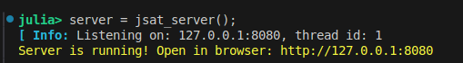
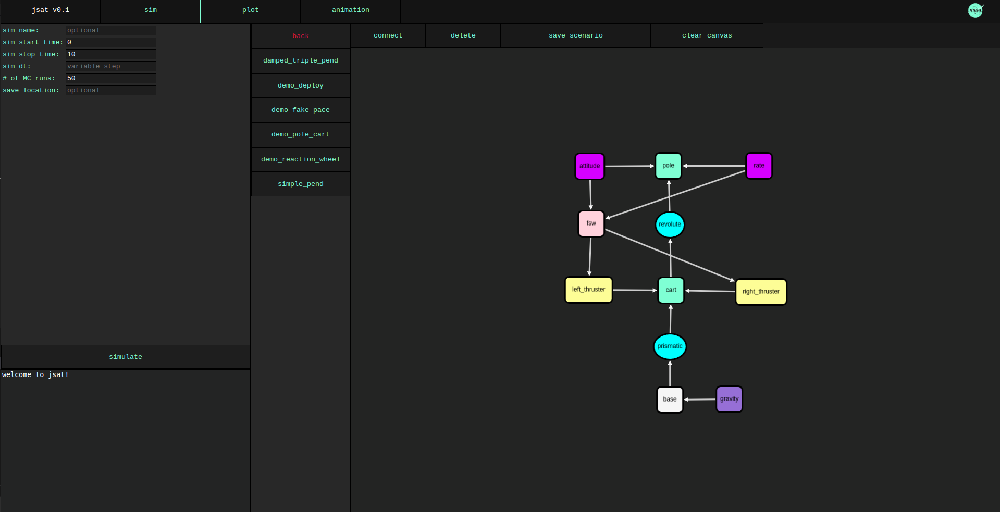
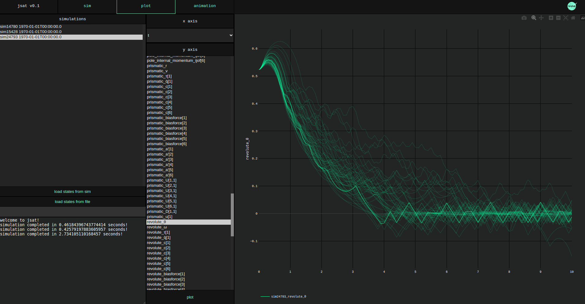
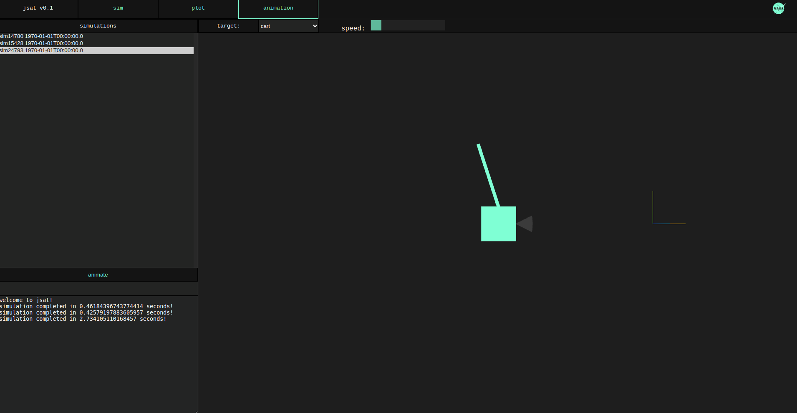
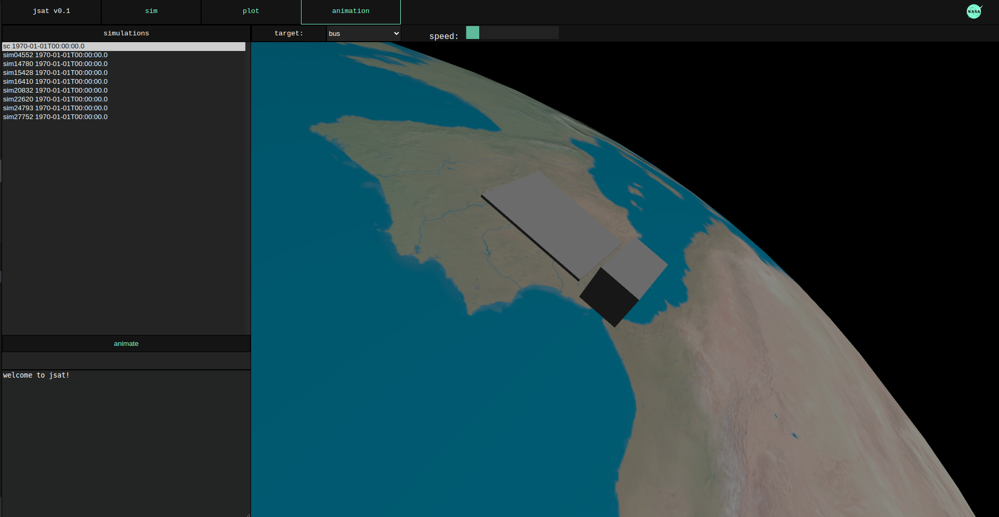

# Intro
The Julia Spacecraft Analysis Tool (JSAT) was created in 2022  as a proof of concept for a web-based multibody spacecraft simulation tool. It takes advantage of the speed and syntax of Julia while utilizing the popularity of web development as a user interface.

# Disclaimer
This tool is currently just a proof of concept that may be revisited in the future. It is missing many features and is likely to contain numerous bugs.

# Getting Started
1. Clone the repo 
2. cd to the root of the cloned repo
3. Ensure you have julia installed and enter a julia repl environment (type 'julia' in a terminal, or alt-j alt-o in VScode)
4. Include the server source file by typing 'include("server/server.jl")' in the repl. Beware of OS specific path notation.
5. Enter the command 'server = jsat_server()'. This will start the web server on port 8080 which can be closed with 'close(server)'. You should see the following. You can ctrl+click on the server i.p. to go to the web page with your default browser, or navigate to it manually.

6. In the web interface 'sim' tab, you can click on the buttons to select components and place them in the canvas. There are a number of predefined examples that can be loaded from the 'scenarios' button. I recommend the 'pole-cart' example as the most complicated but fully featured example, including dynamics, sensors, actuators, and software. Clicking on the 'demo_pole_cart' button will load the system to the canvas. Click simulate to run. You should see the system recieved as json in the julia repl. Almost always, since system parameters have been changed, julia will have to compile the system and there will be some delay, but then you will see the simulation completed in the bottom left console. All simulation data is stored in the 'sim' folder in the root directory as .csv files. You don't really need to interact with them except to delete or transfer the files.

8. To run a monte carlo, just add some number of runs to the '# of MC runs' text input. If you started julia with 'julia --threads N', N threads will be used to run in parallel, other wise it will simulate the runs in series. By default, pole-cart demo does not have any dispersions. Currently only dispersions on mass properties for bodies are supported (again, proof of concept). Double click the pole block and enter a dispersion of 'Normal(1,0.2)'. Click simulate to run the monte carlo.
9. Once a sim is completed, you will see it listed in the 'plot' and 'animation' tabs. Click the plot tab, and then select the sim you'd like to plot. Click 'load states from sim' to load the plottable states from the sim result. Select the state, or multiple to plot the result. To 3d animate a result, select a sim and click animate from the 'animate' tab.

10. Systems can be composed together interactively from the 'sim' tab. Double clicking a placed item will allow you to change initial states and parameters of the components. Components can be connected together by right clicking and dragging the arrow between components. Double clicking the arrow will allow you to add transforms between the components, if applicable. Once the system is constructed, change sim parameters if needed in the left tab, then click simulate. 

# Future of JSAT
JSAT has mostly been abandoned for a simulator I've developed in the Rust language. Julia is a fantastic language for analysis, my favorite to be sure, but I was given a task to create a simulator that would directly interface with real hardware. I decided to learn an ahead of time compiled language that could build executables for real time operating systems, and did not want to be affected by either JIT compilation or garbage collection. I also wanted to avoid mantaining significant amounts of code in different languages for one simulator (the javascript/html/css is now more than the julia code). By switching to Rust, I was able to avoid garbage collection, build quality executables, and write both the backend and front end in one single language, targetting both native and web interfaces. JSAT may get picked back up in the future, though the focus is likely to be on writing julia more than the web interface.